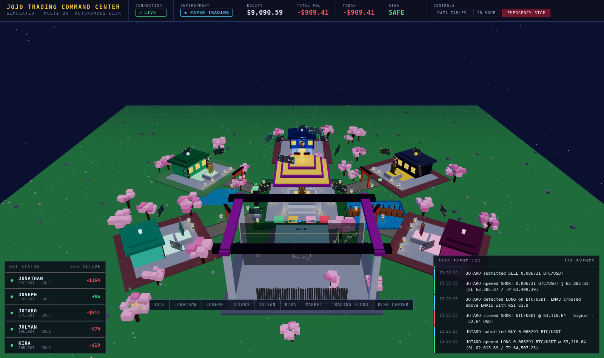

# JOJO Trading Command Center

A live multi-bot crypto trading desk whose interface is a voxel world.

Five autonomous bots — **JONATHAN**, **JOSEPH**, **JOTARO**, **JOLYAN** and
**KIRA** — each run their own strategy on their own market. **JOJO** orchestrates
them from the headquarters at the centre of the world. Every character, aura,
particle and floating board is driven by real backend state: bot status, live
P&L, open positions, risk utilisation and order flow. Clicking a character flies
the camera to their district and opens their trading panel.

The world is the dashboard. The bots are characters. Trades are events happening
inside the world.



---

## Quick start

```bash
pip install -r requirements.txt

cd web && npm install && npm run build && cd ..

python run_bot.py --provider simulated
# → http://localhost:8000
```

`--provider simulated` runs against a synthetic market feed, which is the
fastest way to see the whole system working. Drop the flag to use live Binance
market data (still paper-traded).

For frontend development, run the backend and the Vite dev server side by side:

```bash
python run_bot.py --provider simulated     # :8000
cd web && npm run dev                      # :5173, proxies /api and /ws
```

---

## Paper trading vs. live trading

**The system paper-trades by default and cannot place a real order unless you
open a three-part gate.** All three conditions must hold:

1. `"live_enabled": true` under `trading` in `config.json`
2. an API key *and* secret under `exchange`
3. `LIVE_TRADING_CONFIRM=I_UNDERSTAND_THE_RISK` in the environment

Miss any one and the paper matching engine is used instead, with the reason
reported through `/api/system`. The gate is re-checked on **every order**, not
only at startup, so a config reload can't quietly open it mid-session. The HUD
shows a `PAPER TRADING` or `LIVE TRADING` badge at all times.

The paper engine is not a flattering simulation: buys pay the ask, sells hit the
bid, both take slippage, and fees are charged on notional.

### A note on the configured targets

`USER_GUIDE.md` describes a target of 5–10% daily returns at 10x leverage with
10% of the balance risked per trade. The backtest recorded in `trading_bot.log`
found the opposite: 33 trades, a 21.21% win rate, **-7.93% total**, and **0.00%
of days** reaching the target. The strategy parameters in `config.json` are left
exactly as they were — but the risk surfaces in this build (drawdown, exposure,
per-bot risk auras, the emergency stop) exist to make that reality visible
rather than hide it. Treat the defaults as untested, and start on paper.

---

## Architecture

```
                    ┌──────────────────────────────────────┐
   Binance / synth  │  MarketDataProvider (pluggable)      │
        feed  ─────▶│    binance.py  |  simulated.py       │
                    └──────────────┬───────────────────────┘
                                   ▼
   ┌───────────────────────────────────────────────────────┐
   │  JOJO Orchestrator — registry, heartbeats, capital,   │
   │                      emergency stop, coordination     │
   └───┬───────┬───────┬───────┬───────┬───────────────────┘
       ▼       ▼       ▼       ▼       ▼
    JOLYAN JONATHAN JOSEPH JOTARO  KIRA      (one async agent each)
       │       │       │       │       │
       └───────┴───┬───┴───────┴───────┘
                   ▼
        Strategy ▶ RiskEngine ▶ ExecutionAdapter (paper | live-gated)
                   │
                   ▼
              EventBus ──▶ SQLite (trades, orders, events, audit, equity)
                   │
                   ▼
        FastAPI:  REST /api/*   +   WebSocket /ws
                   │
                   ▼
        React + R3F voxel world  ──(no WebGL / low FPS)──▶  2D dashboard
```

### The roster

| Bot | Strategy | Market | Leverage | Character |
|---|---|---|---|---|
| JONATHAN | momentum (MACD + RSI) | BTC/USDT 15m | 3x | The Foundation — broad silhouette, long coat, shoulder guards |
| JOSEPH | volatility breakout | ETH/USDT 15m | 4x | The Trickster — wide-brimmed hat, scarf |
| JOTARO | scalping (EMA cross + RSI) | BTC/USDT 5m | 5x | The Striker — peaked cap merged into the hair, gold chain |
| JOLYAN | hybrid weighted vote | SOL/USDT 5m | 4x | The Unbound — twin buns, trailing threads |
| KIRA | mean reversion (z-score) | BNB/USDT 15m | 8x | The Quiet One — neat suit and tie, one raised hand |

JOJO orchestrates and holds no positions.

### How the world shows state

| State | The world does this |
|---|---|
| Online | Character breathes and shifts weight, district lit |
| Analyzing | Head down, scanning; holographic data nearby |
| Trading | Striking pose, order projectiles fly to the market |
| Profitable | Gold particle burst, warm district ground, rising P&L |
| Loss | Desaturated district, dark motes, red P&L |
| High risk | Pulsing warning ring and coloured light around the character |
| Offline / halted | Character slumps, lanterns and windows go dark |
| Emergency stop | The whole world turns red, a warning pillar rises over the HQ |

---

## Why trading data always wins

Two mechanisms, because a dashboard that stutters over live prices is worse than
no dashboard:

**On the wire.** Order, fill, position, trade and risk frames are *never*
coalesced or dropped. Decorative price ticks collapse to the latest value per
symbol and flush at a fixed rate, so a fast market cannot starve the lifecycle
stream. If a client is so slow its lifecycle queue overflows, the connection is
closed rather than silently losing a fill.

**In the browser.** Socket frames are applied to the store synchronously, never
behind an animation frame. Visual effects go into a bounded queue with a
per-frame budget and are dropped oldest-first when the budget is exceeded. If
the frame rate still can't hold, quality degrades a tier at a time; if it
*still* can't, the app switches to the 2D dashboard, where every bot, position,
order, trade, event and command remains available.

Force either view with `?mode=2d` or `?mode=3d`.

---

## API

| Endpoint | Purpose |
|---|---|
| `GET /api/health` | liveness, mode, provider |
| `GET /api/state` | the full snapshot the world renders from |
| `GET /api/system` | execution mode and why the live gate is open or shut |
| `GET /api/bots`, `/api/bots/{id}` | roster and per-bot detail |
| `POST /api/bots/{id}/command` | `start` · `pause` · `resume` · `stop` · `flatten` |
| `GET /api/positions`, `/orders`, `/trades`, `/events`, `/risk`, `/portfolio`, `/equity` | book and history |
| `GET /api/market/{symbol}/klines` | candles (accepts `BTCUSDT` or `BTC/USDT`) |
| `GET /api/audit` | append-only audit trail |
| `POST /api/system/emergency-stop`, `/resume` | kill switch |

**WebSocket `/ws`** sends one `snapshot` frame on connect, then deltas:
`bot.status` · `bot.signal` · `bot.heartbeat` · `order.submitted` ·
`order.filled` · `order.cancelled` · `position.opened` · `position.updated` ·
`position.closed` · `trade.closed` · `pnl.tick` · `risk.update` ·
`market.tick` · `market.kline` · `event.log` · `system.emergency_stop` ·
`market.provider_degraded`.

Clients send `bot.<action>`, `system.emergency_stop`, `system.resume`,
`snapshot.request` and `ping`.

---

## Configuration

`config.json` is the source of truth. Strategy parameters, symbols and risk
limits are read from the blocks that were already there.

One semantic change worth knowing: `risk_management.max_open_trades` was written
for a single-bot system, so it is now the **per-bot** cap, and a desk-wide cap
(`max_portfolio_positions`) is derived from it. Without that, three bots filled
the book and the other two could never trade at all.

Environment overrides: `JOJO_PROVIDER`, `JOJO_HOST`, `JOJO_PORT`, `JOJO_SEED`,
`JOJO_DATA_DIR`, `JOJO_INITIAL_BALANCE`, `BINANCE_API_KEY`,
`BINANCE_API_SECRET`.

---

## Tests

```bash
pytest                       # 105 backend tests
cd web && npm run build      # typecheck + production build
cd web && npx playwright test # 9 end-to-end tests against a live backend
```

The end-to-end suite needs a backend running on the port in
`web/playwright.config.ts` (8012 by default):

```bash
JOJO_PROVIDER=simulated python -m uvicorn backend.app:app --port 8012
```

It drives the real world in a real browser: renders it, flies the camera,
selects bots, opens the tables, triggers the emergency stop and checks the
backend actually halted, and confirms the 2D fallback carries the full desk.
Screenshots land in `web/screenshots/`.

---

## Keyboard

`1`–`5` select a bot · `W` world view · `J` headquarters · `M` market room ·
`T` data tables · `Esc` deselect

---

## Disclaimer

Trading carries real financial risk, and leverage multiplies it. Past results —
including the backtest in this repository — do not predict future results. Run
on paper until you have your own evidence, and never trade money you cannot
afford to lose.
